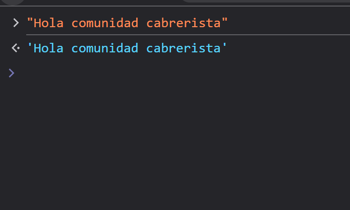
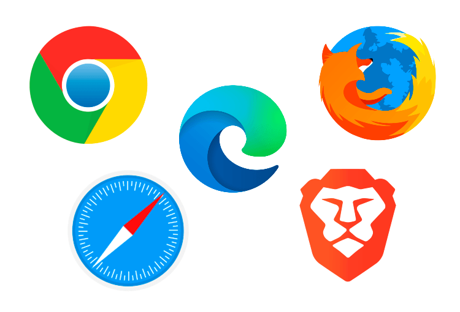
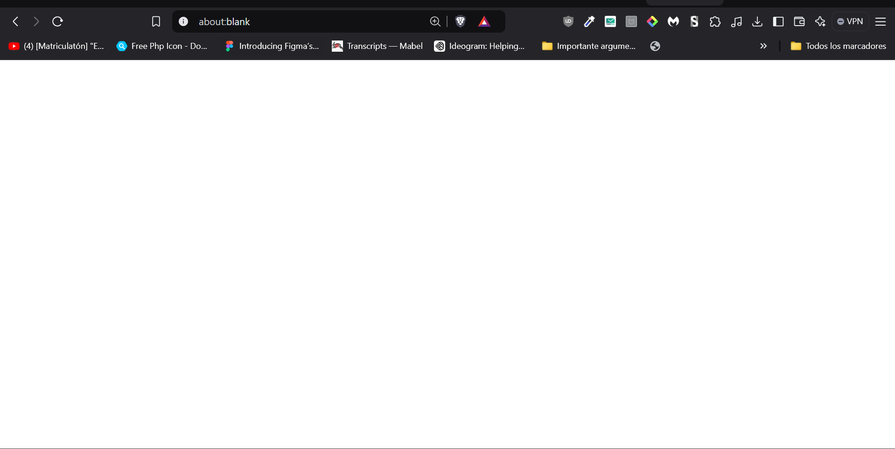
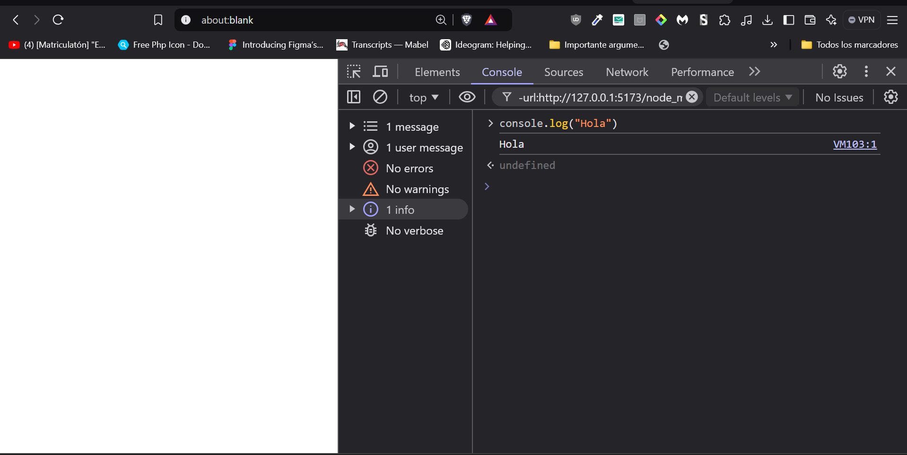

# Fundamentos de Programación con JavaScript


## ¿Qué es la Programación?

La programación es el proceso de crear instrucciones detalladas que indican a una computadora cómo realizar tareas, paso a paso. Estas instrucciones se escriben en lenguajes específicos que la máquina puede entender, como JavaScript, Python o C++. Es similar a escribir una receta: en lugar de cocinar alimentos, estamos "cocinando" soluciones, aplicaciones o sistemas que realizan tareas automáticamente.

Programar implica resolver problemas de manera eficiente, traduciendo ideas en código que la computadora puede ejecutar. La programación no es solo técnica; también es un proceso creativo. Nos permite construir desde una simple calculadora hasta aplicaciones complejas, juegos y programas que manejan datos, impactando así nuestra vida cotidiana.

## ¿Por qué es Importante la Programación?

Aprender a programar es esencial porque nos proporciona herramientas poderosas para resolver problemas en cualquier contexto. Comprender cómo funcionan las aplicaciones y sistemas que utilizamos diariamente nos ayuda a adaptarnos a un mundo tecnológico en constante evolución. Además, la programación fomenta el desarrollo del pensamiento lógico y las habilidades de resolución de problemas, que son valiosas en cualquier área de estudio o trabajo.


## ¿Qué es JavaScript?


JavaScript es un lenguaje de programación ampliamente utilizado para crear sitios web interactivos y dinámicos. Es el "cerebro" detrás de muchas funciones en una página web, como cambios de color de botones al hacer clic, validación de formularios y gráficos en tiempo real. Aunque se asocia comúnmente con el desarrollo web, JavaScript también se utiliza en el desarrollo de aplicaciones móviles, de escritorio e incluso en el control de dispositivos como drones o robots.

## Cómo Interactuar con la Consola de JavaScript



### Guía para abrir la consola de desarrolladores y escribir código en JavaScript

1. **Usa tu navegador preferido.**



2. **Accede a la siguiente URL:** `about:blank`  
   <p>Esto te dará un espacio en blanco para escribir tu código.</p>



3. **Abre la consola de desarrolladores presionando `F12`.**



## Tipos de Datos en JavaScript

JavaScript tiene varios tipos de datos. Los más comunes son:

```javascript
23; // Número entero.
2.34; // Número decimal.
"¡Hola, Estudiantes!"; // Cadena de texto con comillas dobles.
`¡Hola, Estudiantes!` // Cadena de texto con comillas invertidas.
true; // Valor booleano (verdadero).
false; // Valor booleano (falso).
```

### Tipos de Variables

Las variables son espacios de memoria utilizados para almacenar valores. Se pueden crear, modificar y eliminar de manera similar a las cadenas de texto.

#### Ejemplo

```javascript
var esMayorDeEdad = true; // Variable de ámbito global o de función.
let nombre = "Andres Felipe"; // Variable de ámbito de bloque.
const edad = 14; // Variable de ámbito de bloque, constante.
```

### Mostrar Valores en Consola

```javascript
// Ejemplo #1
let nombre = "Andres Felipe"; 
console.log(nombre); // Muestra: "Andres Felipe"

// Ejemplo #2
let edad = 23; 
console.log(edad); // Muestra: 23
```

### Ejercicio Práctico ⌨️

1. Declara una variable llamada `nombre` y asígnale tu primer nombre. Luego, muestra su valor en consola.

```javascript
let nombre = "Andres"; 
console.log(nombre); // Resultado: "Andres" ✅
```

### Operadores Aritméticos

Los operadores aritméticos permiten realizar operaciones como suma, resta, multiplicación y división.

```javascript
let n1 = 25; 
let n2 = 13; 

let suma = n1 + n2; 
console.log(suma); // Resultado: 38 ✅

let resta = n1 - n2; 
console.log(resta); // Resultado: 12 ✅

let multiplicacion = n1 * n2; 
console.log(multiplicacion); // Resultado: 325 ✅

let division = n1 / n2; 
console.log(division); // Resultado: 1.92307 ✅

let residuo = n1 % n2; 
console.log(residuo); // Resultado: 12 ✅
```

### Ejercicio Práctico ⌨️

2. Declara una variable `lado`, asígnale un valor entero y calcula el área del cuadrado.

```javascript
let lado = 5; 
let area = lado * lado; 
console.log("El área del cuadrado es: " + area); // Resultado: 25 ✅
```

### Ejercicio Práctico ⌨️

3. Declara una variable `numero` y asígnale un valor entero. Escribe un código que verifique si es par o impar, mostrando `true` si es par y `false` si es impar.

```javascript
let numero = 5; 
let verificar = numero % 2 == 0; 
console.log(verificar); // Resultado: false ✅
```

### Estructuras de Control Condicional y Caso

Las estructuras de control permiten gestionar el flujo de ejecución de un programa. Incluyen:

```javascript
// (if y else) ✅
let edad = 14; 

if (edad >= 18) {
    console.log("Es mayor de edad");
} else {
    console.log("Es menor de edad");
}

// (switch) ✅
let nota = 4; 

switch (nota) {
    case 1:
        console.log("Lo siento, usted ha perdido la nota");
        break;
    case 2:
        console.log("Lo siento, usted ha perdido la nota");
        break;
    case 3:
        console.log("Uyy, usted ha aprobado la nota por poco");
        break;
    case 4:
        console.log("Felicidades, muy bien aprobaste la nota"); // Respuesta correcta ✅
        break;
    default:
        console.log("Esa nota no existe");
        break;   
}
```

### Ejercicio Práctico ⌨️

4. Declara dos variables `num1` y `num2` y asígnales valores enteros. Compara ambos números y muestra en consola cuál es el mayor, o si son iguales.

```javascript
let num1 = 14; 
let num2 = 8; 

if (num1 > num2) {
    console.log("El primer valor es mayor"); // Respuesta correcta ✅
} else if (num1 < num2) {
    console.log("El segundo valor es mayor");
} else {
    console.log("Los valores son iguales");
}
```

### Estructura de Control Bloque Iterativo

Un bucle o loop es una secuencia de instrucciones que se repite un número de veces.

```javascript
// Bucle while
let i = 1;
while (i < 5) {
    console.log("Este es el ciclo número: " + i);
    i++;
}

// Bucle for
for (let i = 1; i <= 10; i++) {
    console.log(i);
}
```

### Ejercicio Práctico ⌨️

5. Declara una variable llamada `numero` y asígnale un valor entero. Utiliza un ciclo `for` para mostrar en consola cada número hasta el valor de la variable.

```javascript
for (let i = 1; i <= 15; i++) {
    console.log(i); // Respuesta: 1, 2, 3, ..., 15 ✅
}
```

### Funciones

Una función es un bloque de código que se ejecuta al ser llamada. Pueden recibir argumentos y devolver valores.

```javascript
// Ejemplo #1
function Saludar() {
    return "Hola, estudiantes"; // Devuelve el saludo. ✅
}
Saludar();

// Ejemplo #2
function SaludarEstudiante(nombre, apellido) {
    return "Hola, tu nombre es " + nombre + " y tu apellido es " + apellido;
}
SaludarEstudiante("Andres", "Felipe"); // Respuesta: "Hola, tu nombre es Andres y tu apellido es Felipe" ✅        
```

### Ejercicio Práctico ⌨️

6. Crea una función llamada `doblarNumero` que tome un número como parámetro y devuelva el doble de ese número.

```javascript
function DoblarNumero(numero) {
    return numero * 2;
}
DoblarNumero(5); // Respuesta: 10 ✅
```

